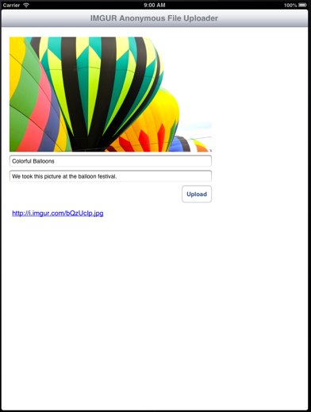

IMGUR Uploader
===================================

This project demonstrates how to upload an image to IMGUR anonymously using the v3 API. The endpoint for this service is: https://api.imgur.com/3/upload.json. 

OVERVIEW
-----------------------------------
You will need to register your app with imgur here: https://api.imgur.com/oauth2/addclient. A client ID will be generated and sent to your email. You will then plug that into the code in this project.




Here is how you use the code. To initiate an upload from a button tap, you would do this:

```
- (IBAction)didTapUploadButton:(id)sender
{
  NSString *clientID = @"YOUR_CLIENT_ID_HERE";

  NSString *title = [[self titleTextField] text];
  NSString *description = [[self descriptionTextField] text];
  
  __weak MLViewController *weakSelf = self;
  // Load the image data up in the background so we don't block the UI
  dispatch_async(dispatch_get_global_queue(DISPATCH_QUEUE_PRIORITY_DEFAULT, 0), ^{
    UIImage *image = [UIImage imageNamed:@"balloons.jpg"];
    NSData *imageData = UIImageJPEGRepresentation(image, 1.0f);
    
    [[UIApplication sharedApplication] setNetworkActivityIndicatorVisible:YES];
    [MLIMGURUploader uploadPhoto:imageData title:title description:description imgurClientID:clientID completionBlock:^(NSString *result) {
      dispatch_async(dispatch_get_main_queue(), ^{
        [[UIApplication sharedApplication] setNetworkActivityIndicatorVisible:NO];
        [[weakSelf linkTextView] setText:result];
      });
    } failureBlock:^(NSURLResponse *response, NSError *error, NSInteger status) {
      dispatch_async(dispatch_get_main_queue(), ^{
      [[UIApplication sharedApplication] setNetworkActivityIndicatorVisible:NO];
      [[[UIAlertView alloc] initWithTitle:@"Upload Failed"
                                  message:[NSString stringWithFormat:@"%@ (Status code %d)", [error localizedDescription], status]
                                 delegate:nil
                        cancelButtonTitle:nil
                        otherButtonTitles:@"OK", nil] show];
      });
    }];
    
  });
}
```

This code uses no third party libraries, however, it does require ARC and iOS5 or later due to the use of NSURLConnection's [sendAsynchronousRequest:queue:completionHandler:](https://developer.apple.com/library/mac/#documentation/Cocoa/Reference/Foundation/Classes/NSURLConnection_Class/Reference/Reference.html#//apple_ref/occ/clm/NSURLConnection/sendAsynchronousRequest:queue:completionHandler:). The entire uploader functionality is in a single method. It looks like this:

```
+ (void)uploadPhoto:(NSData*)imageData
              title:(NSString*)title
        description:(NSString*)description
      imgurClientID:(NSString*)clientID
    completionBlock:(void(^)(NSString* result))completion
       failureBlock:(void(^)(NSURLResponse *response, NSError *error, NSInteger status))failureBlock
{
  NSAssert(imageData, @"Image data is required");
  NSAssert(clientID, @"Client ID is required");
  
  NSString *urlString = @"https://api.imgur.com/3/upload.json";
  NSMutableURLRequest *request = [[NSMutableURLRequest alloc] init] ;
  [request setURL:[NSURL URLWithString:urlString]];
  [request setHTTPMethod:@"POST"];
  
  NSMutableData *requestBody = [[NSMutableData alloc] init];
  
  NSString *boundary = @"---------------------------0983745982375409872438752038475287";
  
  NSString *contentType = [NSString stringWithFormat:@"multipart/form-data; boundary=%@", boundary];
  [request addValue:contentType forHTTPHeaderField:@"Content-Type"];
  
  // Add client ID as authrorization header
  [request addValue:[NSString stringWithFormat:@"Client-ID %@", clientID] forHTTPHeaderField:@"Authorization"];
  
  // Image File Data
  [requestBody appendData:[[NSString stringWithFormat:@"--%@\r\n", boundary] dataUsingEncoding:NSUTF8StringEncoding]];
  [requestBody appendData:[@"Content-Disposition: attachment; name=\"image\"; filename=\".tiff\"\r\n" dataUsingEncoding:NSUTF8StringEncoding]];
  
  [requestBody appendData:[@"Content-Type: application/octet-stream\r\n\r\n" dataUsingEncoding:NSUTF8StringEncoding]];
  [requestBody appendData:[NSData dataWithData:imageData]];
  [requestBody appendData:[@"\r\n" dataUsingEncoding:NSUTF8StringEncoding]];
  
  // Title parameter
  if (title) {
    [requestBody appendData:[[NSString stringWithFormat:@"--%@\r\n", boundary] dataUsingEncoding:NSUTF8StringEncoding]];
    [requestBody appendData:[[NSString stringWithFormat:@"Content-Disposition: form-data; name=\"title\"\r\n\r\n"] dataUsingEncoding:NSUTF8StringEncoding]];
    [requestBody appendData:[title dataUsingEncoding:NSUTF8StringEncoding]];
    [requestBody appendData:[@"\r\n" dataUsingEncoding:NSUTF8StringEncoding]];
  }
  
  // Description parameter
  if (title) {
    [requestBody appendData:[[NSString stringWithFormat:@"--%@\r\n", boundary] dataUsingEncoding:NSUTF8StringEncoding]];
    [requestBody appendData:[[NSString stringWithFormat:@"Content-Disposition: form-data; name=\"description\"\r\n\r\n"] dataUsingEncoding:NSUTF8StringEncoding]];
    [requestBody appendData:[description dataUsingEncoding:NSUTF8StringEncoding]];
    [requestBody appendData:[@"\r\n" dataUsingEncoding:NSUTF8StringEncoding]];
  }
  
  [requestBody appendData:[[NSString stringWithFormat:@"--%@--\r\n", boundary] dataUsingEncoding:NSUTF8StringEncoding]];
  
  [request setHTTPBody:requestBody];
  
  [NSURLConnection sendAsynchronousRequest:request queue:[NSOperationQueue mainQueue] completionHandler:^(NSURLResponse *response, NSData *data, NSError *error) {
    NSDictionary *responseDictionary = [NSJSONSerialization JSONObjectWithData:data options:NSJSONReadingMutableContainers error:nil];
    if ([responseDictionary valueForKeyPath:@"data.error"]) {
      if (failureBlock) {
        if (!error) {
          // If no error has been provided, create one based on the response received from the server
          error = [NSError errorWithDomain:@"imguruploader" code:10000 userInfo:@{NSLocalizedFailureReasonErrorKey : [responseDictionary valueForKeyPath:@"data.error"]}];
        }
        failureBlock(response, error, [[responseDictionary valueForKey:@"status"] intValue]);
      }
    } else {
      if (completion) {
        completion([responseDictionary valueForKeyPath:@"data.link"]);
      }
      
    }
    
  }];
}
```

RESULTS
-------------------------------------
When the request to the imgur service returns, you will have a link to the raw image you uploaded. If you want to view that image with the title and description you provided, simply remove the file extension. So, for example, this link returns the raw image: http://i.imgur.com/bQzUcIp.jpg, but this link http://i.imgur.com/bQzUcIp displays the imgur website chrome and all of the meta you provided in the upload call.

LICENSE
-------------------------------------
The code is MIT licensed. Have fun with it. Submit pull requests if you add something helpful or interesting.

Thanks and have fun.


